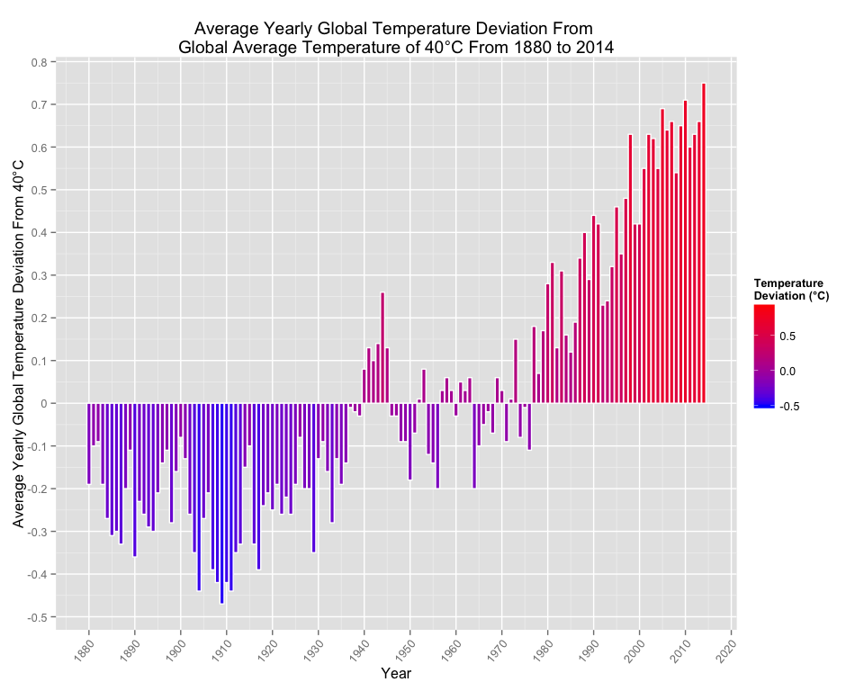
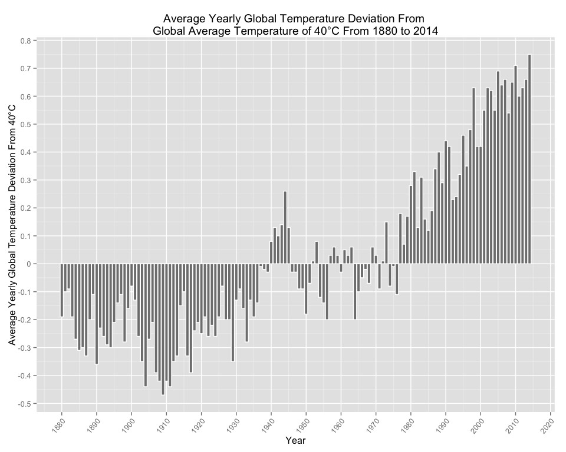
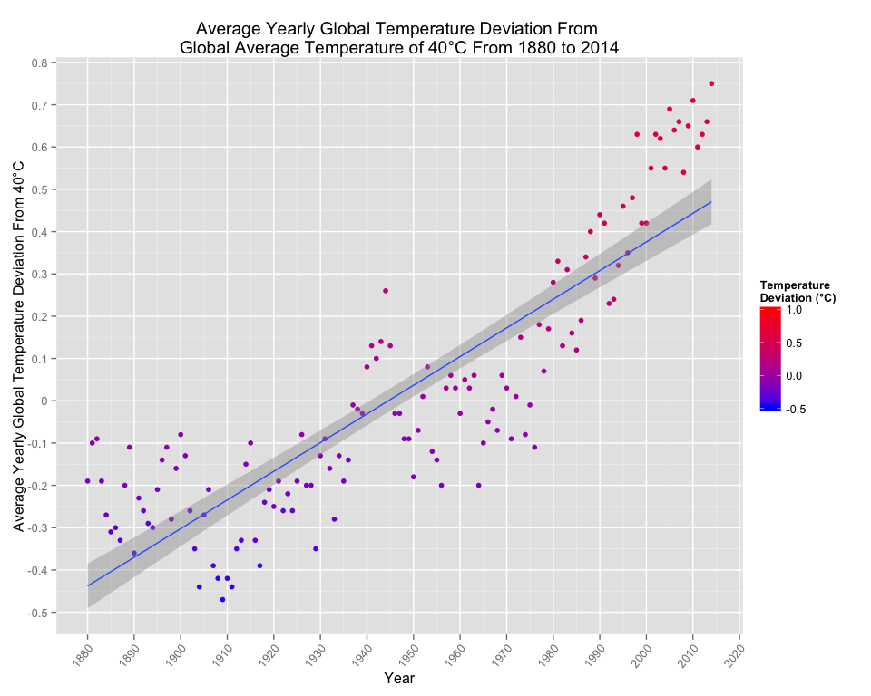
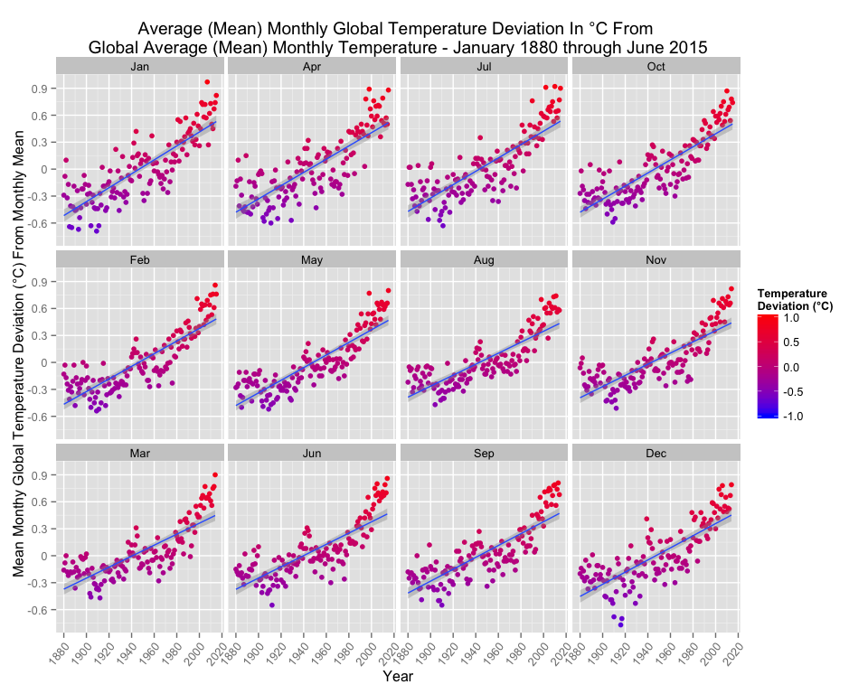

# Data Visualization: Peer Assessment 1
Carl M Smith  
`r Sys.Date()`  


## Synopsis

*Immediately after the title, there should be a synopsis which describes and summarizes your analysis in at most 10 complete sentences.*


## Data Processing


*which describes (in words and code) how the data were loaded into R and processed for analysis. In particular, your analysis must start from the raw CSV file containing the data. You cannot do any preprocessing outside the document. If preprocessing is time-consuming you may consider using the cache = TRUE option for certain code chunks.*


## Loading and preprocessing the data


```r
# load needed libraries
library(knitr)
library(plyr)
library(dplyr, warn.conflicts=FALSE)
library(grid)
library(ggplot2)
library(gridExtra) 
library(lubridate, warn.conflicts=FALSE)
library(stringr)
library(reshape2)

 
  # "as long as each of those files is in your current working directory (check by
  # calling dir() and see if those files are in the listing)." 
  # I use !file.exists("filename") to make the same check.
  #
  # Check to see if the exdata-data-NEI_data/*.rds files are around.
  if(!file.exists("Programming Assignment 1 Data New/ExcelFormattedGISTEMPDataCSV.csv") 
        || !file.exists("Programming Assignment 1 Data New/ExcelFormattedGISTEMPData2CSV.csv")) {
    
    ## Check if the "exdata-data-NEI_data.zip" file is around. If it is in the
    ## current working directory, then just unzip the two .rds files, if the zip
    ## file isn't around, download it and then unzip it.
    
    if(!file.exists("Data New.zip")) {
      fileURL <- "https://d396qusza40orc.cloudfront.net/datavisualization/programming_assignment_1/Programming%20Assignment%201%20Data%20New.zip"
      download.file(fileURL, destfile="Data New.zip",
                    method="curl",mode="wb")
      dataDownloaded <- date()
      print(paste("Downloaded PM2.5 Emissions Data zip file on", dataDownloaded))
    }
    
    # Unzip the exdata-data-NEI_data.zip/*.rds files so they can be read and used to produce
    # the plot.
    # Calling unzip from R on my Mac puts the .rds files in the current working directory.
    unzip("Data New.zip")        
  }

 
  
## 
monthdata <- read.csv("Programming Assignment 1 Data New/ExcelFormattedGISTEMPDataCSV.csv", 
                      stringsAsFactors = FALSE)
yeardata <- read.csv("Programming Assignment 1 Data New/ExcelFormattedGISTEMPData2CSV.csv", 
                     stringsAsFactors = FALSE)
names(yeardata)[2] <- "GlobalTemp"


yeardata$GlobalTemp <- yeardata$GlobalTemp * 0.01


monthdata2 <- select(monthdata, Year:Dec)
molten_month <- melt(monthdata2,id.vars=c("Year"))
molten_month <- rename(molten_month, Month=variable, GlobalTemp=value)
month_ordering <- c("Jan","Apr","Jul","Oct","Feb","May","Aug","Nov","Mar","Jun","Sep","Dec")
#x <- unique(molten_month$Month)
#molten_month <- factor(x,levels(month_ordering))
# chnage level ordering to make a nice layout for faceted panel plot
levels(molten_month$Month) = c("Jan","Apr","Jul","Oct","Feb","May","Aug","Nov","Mar","Jun","Sep","Dec")
# make the temp values integers
molten_month$GlobalTemp <- as.integer(molten_month$GlobalTemp)
```

```
## Warning: NAs introduced by coercion
```

```r
# remove the rows that don't have complete values (they are missing the temp value)
molten_month <- molten_month[complete.cases(molten_month),]
# easier to multiply the monthly temps now that they are in one column
# changing the temp values to degree Celcius
molten_month$GlobalTemp <- molten_month$GlobalTemp * 0.01


g <- ggplot(yeardata, aes(x =Year, y = GlobalTemp, fill=GlobalTemp)) +
        geom_bar(stat = "identity", colour = "white") +
        xlab("Year") +
        ylab("Average Yearly Global Temperature Deviation From 40°C") +
        scale_y_continuous(breaks=c(-0.50,-0.40,-0.30,-0.20,-0.10,0,0.10,0.20,0.30,0.40,0.50,0.60,0.70,0.80,0.90),
                           labels=c(-0.50,-0.40,-0.30,-0.20,-0.10,0,0.10,0.20,0.30,0.40,0.50,0.60,0.70,0.80,0.90)) +
        theme(axis.text.x=element_text(angle=50, vjust=1.0, hjust=1.0)) +
        scale_x_continuous(breaks=c(1880,1890,1900,1910,1920,1930,1940,1950,1960,1970,1980,1990,2000,
                                    2010,2020),
                           labels=c(1880,1890,1900,1910,1920,1930,1940,1950,1960,1970,1980,1990,2000,
                                    2010,2020)) +
        scale_fill_gradient(limits=c(-0.50, 0.90), low="blue", high="red", space = "Lab", 
                            name="Temperature\nDeviation (°C)") +
        ggtitle("Average Yearly Global Temperature Deviation From \nGlobal Average Temperature of 40°C From 1880 to 2014")
        
# scale_fill_gradient(low="#FF8888",high="#FF0000")
```


```
## Warning: Stacking not well defined when ymin != 0
```

 
 

```r
g1 <- ggplot(yeardata, aes(x =Year, y = GlobalTemp)) +
        geom_bar(stat = "identity", colour = "white", fill="grey50") +
        xlab("Year") +
        ylab("Average Yearly Global Temperature Deviation From 40°C") +
        scale_y_continuous(breaks=c(-0.50,-0.40,-0.30,-0.20,-0.10,0,0.10,0.20,0.30,0.40,0.50,0.60,0.70,0.80,0.90),
                           labels=c(-0.50,-0.40,-0.30,-0.20,-0.10,0,0.10,0.20,0.30,0.40,0.50,0.60,0.70,0.80,0.90)) +
        theme(axis.text.x=element_text(angle=50, vjust=1.0, hjust=1.0)) +
        scale_x_continuous(breaks=c(1880,1890,1900,1910,1920,1930,1940,1950,1960,1970,1980,1990,2000,
                                    2010,2020),
                           labels=c(1880,1890,1900,1910,1920,1930,1940,1950,1960,1970,1980,1990,2000,
                                    2010,2020)) +
        ggtitle("Average Yearly Global Temperature Deviation From \nGlobal Average Temperature of 40°C From 1880 to 2014")
        
# scale_fill_gradient(low="#FF8888",high="#FF0000")
```


```
## Warning: Stacking not well defined when ymin != 0
```

 


```r
g2 <- ggplot(yeardata, aes(x =Year, y = GlobalTemp)) +
        geom_point(stat = "identity", aes(colour = GlobalTemp)) +
        geom_smooth(method = "lm") +
        #geom_bar(stat = "identity", colour = "white", fill="grey50") +
        xlab("Year") +
        ylab("Average Yearly Global Temperature Deviation From 40°C") +
        scale_y_continuous(breaks=c(-0.50,-0.40,-0.30,-0.20,-0.10,0,0.10,0.20,0.30,0.40,0.50,0.60,0.70,0.80,0.90),
                           labels=c(-0.50,-0.40,-0.30,-0.20,-0.10,0,0.10,0.20,0.30,0.40,0.50,0.60,0.70,0.80,0.90)) +
        theme(axis.text.x=element_text(angle=50, vjust=1.0, hjust=1.0)) +
        scale_x_continuous(breaks=c(1880,1890,1900,1910,1920,1930,1940,1950,1960,1970,1980,1990,2000,
                                    2010,2020),
                           labels=c(1880,1890,1900,1910,1920,1930,1940,1950,1960,1970,1980,1990,2000,
                                    2010,2020)) +
        scale_color_gradient(limits=c(-0.50, 1.00), low="blue", high="red", space = "Lab", 
                             name="Temperature\nDeviation (°C)") +
        ggtitle("Average Yearly Global Temperature Deviation From \nGlobal Average Temperature of 40°C From 1880 to 2014")
        
# scale_fill_gradient(low="#FF8888",high="#FF0000")
```


 


```r
# http://127.0.0.1:12431/library/dplyr/doc/window-functions.html


g3 <- ggplot(molten_month, aes(x =Year, y = GlobalTemp, group=Month)) +
        geom_point(stat = "identity", aes(colour = GlobalTemp)) +
        geom_smooth(method = "lm") +
        facet_wrap( ~ Month) +
        #geom_bar(stat = "identity", colour = "white", fill="grey50") +
        xlab("Year") +
        ylab("Average Yearly Global Temperature (°C)") +
        scale_y_continuous(breaks=c(-1.00,-0.90,-0.80,-0.70,-0.60,-0.50,-0.40,-0.30,-0.20,-0.10,0,0.10,
                                    0.20,0.30,0.40,0.50,0.60,0.70,0.80,0.90),
                           labels=c(-1.00,-0.90,-0.80,-0.70,-0.60,-0.50,-0.40,-0.30,-0.20,-0.10,0,0.10,
                                    0.20,0.30,0.40,0.50,0.60,0.70,0.80,0.90)) +
        theme(axis.text.x=element_text(angle=50, vjust=1.0, hjust=1.0)) +
        scale_x_continuous(breaks=c(1880,1890,1900,1910,1920,1930,1940,1950,1960,1970,1980,1990,2000,
                                    2010,2020),
                           labels=c(1880,1890,1900,1910,1920,1930,1940,1950,1960,1970,1980,1990,2000,
                                    2010,2020)) +
        scale_color_gradient(limits=c(-1.00, 1.00), low="blue", high="red", space = "Lab", 
                             name="Temperature\nDeviation (°C)") +
        ggtitle("Average Monthly Global Temperature Change (°C) - 1880 through 2014")


g4 <- ggplot(molten_month, aes(x =Year, y = GlobalTemp, group=Month)) +
        geom_point(stat = "identity", aes(colour = GlobalTemp)) +
        geom_smooth(method = "lm") +
        facet_wrap( ~ Month) +
        #geom_bar(stat = "identity", colour = "white", fill="grey50") +
        xlab("Year") +
        ylab("Mean Monthy Global Temperature Deviation (°C) From Monthly Mean") +
        scale_y_continuous(breaks=c(-0.90,-0.60,-0.30,0,0.30,0.60,0.90),
                           labels=c(-0.90,-0.60,-0.30,0,0.30,0.60,0.90)) +
        theme(axis.text.x=element_text(angle=50, vjust=1.0, hjust=1.0)) +
        scale_x_continuous(breaks=c(1880,1900,1920,1940,1960,1980,2000,2020),
                           labels=c(1880,1900,1920,1940,1960,1980,2000,2020)) +
        scale_color_gradient(limits=c(-1.00, 1.00), low="blue", high="red", space = "Lab", 
                             name="Temperature\nDeviation (°C)") +
        ggtitle("Average (Mean) Monthly Global Temperature Deviation In °C From \nGlobal Average (Mean) Monthly Temperature - January 1880 through June 2015")
```

 


##   Results

  *There should be a section titled Results in which your results are presented.*
  


### System Details

```r
session_details <- sessionInfo()
session_details
```

```
## R version 3.2.0 (2015-04-16)
## Platform: x86_64-apple-darwin13.4.0 (64-bit)
## Running under: OS X 10.10.4 (Yosemite)
## 
## locale:
## [1] en_US.UTF-8/en_US.UTF-8/en_US.UTF-8/C/en_US.UTF-8/en_US.UTF-8
## 
## attached base packages:
## [1] grid      stats     graphics  grDevices utils     datasets  methods  
## [8] base     
## 
## other attached packages:
## [1] reshape2_1.4.1  stringr_1.0.0   lubridate_1.3.3 gridExtra_2.0.0
## [5] ggplot2_1.0.1   dplyr_0.4.2     plyr_1.8.3      knitr_1.10.5   
## 
## loaded via a namespace (and not attached):
##  [1] Rcpp_0.12.0      magrittr_1.5     MASS_7.3-40      munsell_0.4.2   
##  [5] colorspace_1.2-6 R6_2.1.0         tools_3.2.0      parallel_3.2.0  
##  [9] gtable_0.1.2     DBI_0.3.1        htmltools_0.2.6  lazyeval_0.1.10 
## [13] yaml_2.1.13      assertthat_0.1   digest_0.6.8     formatR_1.2     
## [17] memoise_0.2.1    evaluate_0.7     rmarkdown_0.7    labeling_0.3    
## [21] stringi_0.5-5    scales_0.2.5     proto_0.3-10
```
  
  
  
  
